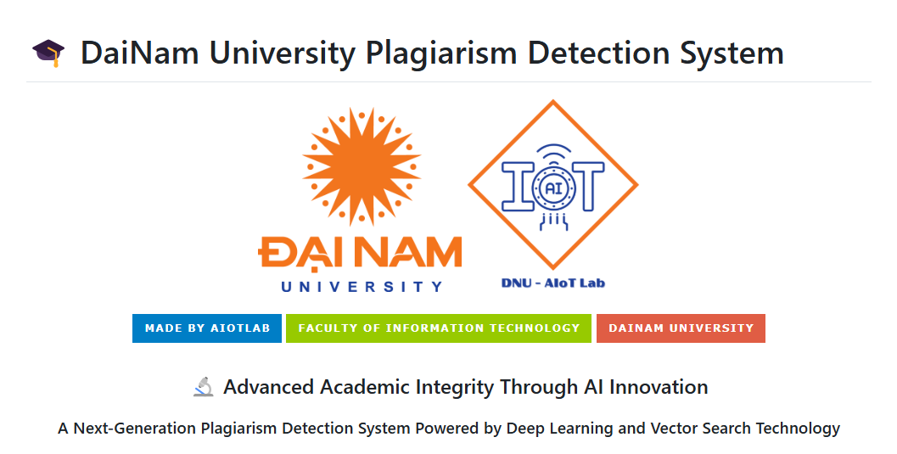
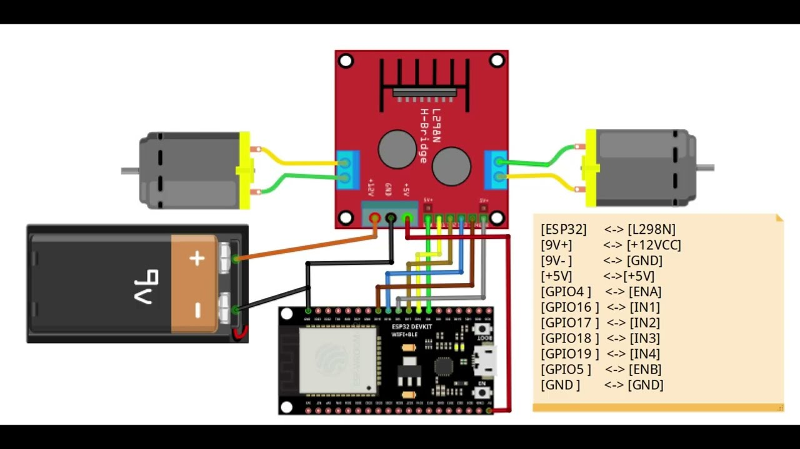
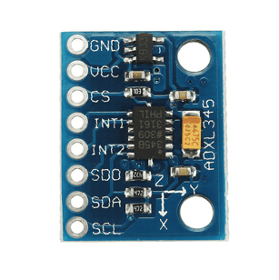
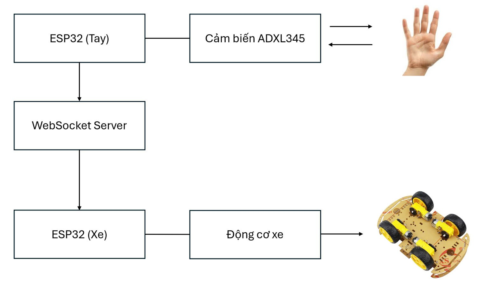
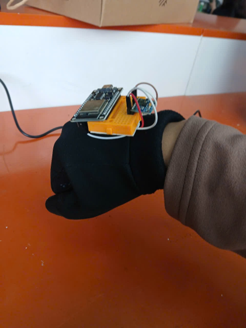
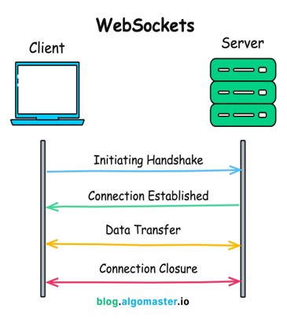
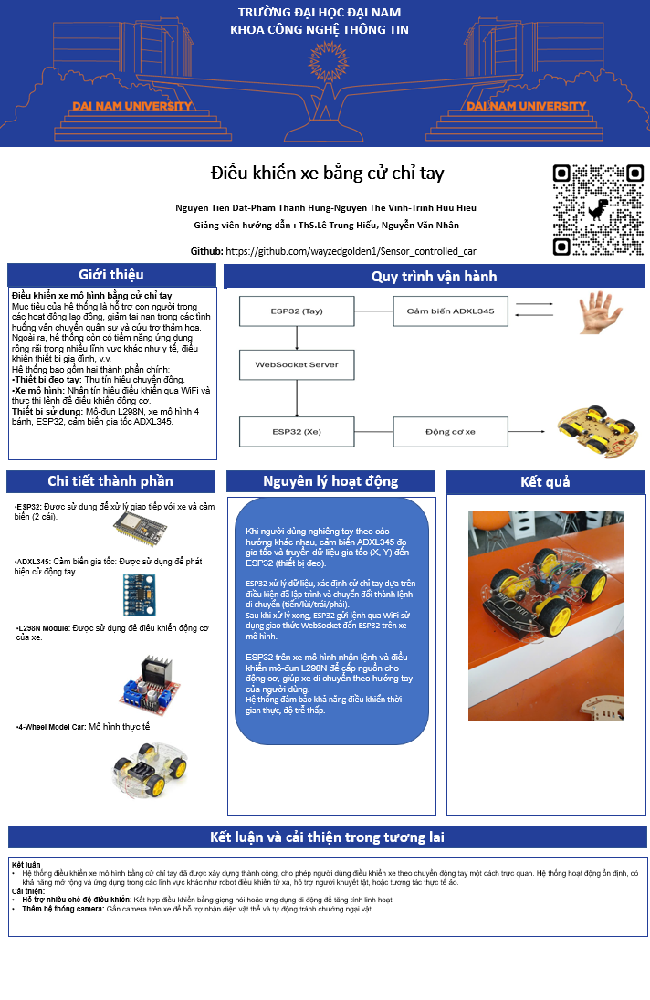

## Kết nối dây trên xe mô hình

### Hệ thống
Hệ thống gồm hai thành phần chính:

- **Thiết bị đeo tay**: Bao gồm **ESP32, cảm biến ADXL345**, kết nối **WiFi** để gửi dữ liệu chuyển động.
- 
- **Xe mô hình**: Nhận tín hiệu điều khiển từ **WiFi** và thực thi lệnh thông qua **Module L298N** để điều khiển động cơ.)

### 1. Kết nối ESP32 với Driver L298 (Điều khiển động cơ xe)

| ESP32 | L298 |
|--------|------|
| 3.3V | 5V (qua Buck Converter 5V) |
| GND | GND |
| D5 | IN1 |
| D18 | IN2 |
| D19 | IN3 |
| D21 | IN4 |
| D23 | ENA (PWM) |
| D22 | ENB (PWM) |

- **Motor 1 (trái):** Cắm vào OUT1, OUT2 của L298.
- **Motor 2 (phải):** Cắm vào OUT3, OUT4 của L298.
- **Nguồn động cơ:** Cắm 7V - 12V vào VCC của L298.

### 2. Kết nối Cảm biến Gia tốc ADXL345 (Gắn trên tay để điều khiển xe)

Cảm biến **ADXL345** sử dụng giao tiếp **I2C**, kết nối như sau:

| ESP32 | ADXL345 |
|--------|--------------|
| 3.3V | VCC |
| GND | GND |
| D18 | CS |
| D19 | SDO |
| D23 | SDA |
| D5 | SCL |

### Thiết bị
- **ESP32**: Dùng để xử lý giao tiếp với xe và cảm biến (2 cái).
- **Cảm biến gia tốc ADXL345**: Nhận diện chuyển động tay.
- **Module L298N**: Điều khiển động cơ xe.
- **Xe mô hình 4 bánh**: Mô hình thực hành.

### Quy trình

1. **Đọc dữ liệu từ ADXL345**
   - Sử dụng giao thức **I2C/SPI** để lấy dữ liệu gia tốc từ **ADXL345**.
   - Xử lý giá trị gia tốc theo trục **X, Y** để xác định hướng nghiêng.

2. **Xử lý dữ liệu để nhận diện cử chỉ**
   
   - Nếu **tay nghiêng trước** → **Tiến tới**.
   - Nếu **tay nghiêng sau** → **Lùi**.
   - Nếu **tay nghiêng trái** → **Rẽ trái**.
   - Nếu **tay nghiêng phải** → **Rẽ phải**.
   - Nếu **tay giữ thẳng** → **Dừng lại**.

3. **Gửi dữ liệu qua WiFi**
  
   - **ESP32 trên tay** gửi tín hiệu điều khiển qua **WiFi** sử dụng giao thức **WebSocket**.
   - **ESP32 trên xe** nhận tín hiệu và chuyển đổi thành lệnh điều khiển động cơ.

4. **Điều khiển động cơ xe**
   - Sử dụng **Module L298N** để điều khiển động cơ.
   - Lập trình **PWM** để điều chỉnh tốc độ và hướng di chuyển.

Sau khi kết nối dây, bạn có thể sử dụng thư viện **Adafruit_ADXL345** hoặc **SparkFun_ADXL345** để đọc dữ liệu gia tốc, rồi gửi tín hiệu về **ESP32 trên xe** qua **WiFi** hoặc **Bluetooth**.

## Thành viên dự án

| Họ và tên         | Vai trò                                              |
|------------------|----------------------------------------------------|
| Nguyễn Tiến Đạt | Phát triển mã nguồn, đề xuất cải tiến, triển khai dự án |
| Phạm Thành Hưng | Đề xuất cải tiến, đề xuất dự án, viết báo cáo, hỗ trợ triển khai dự án |
| Trịnh Hữu Hiệu  | Biên soạn tài liệu, thiết kế slide, hỗ trợ triển khai dự án |
| Nguyễn Thế Vinh | Hỗ trợ triển khai dự án |

